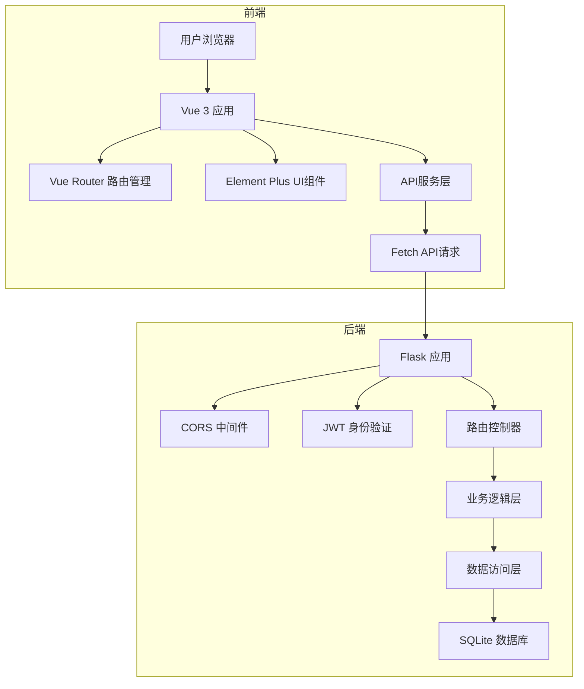
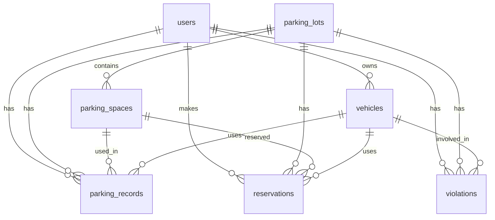
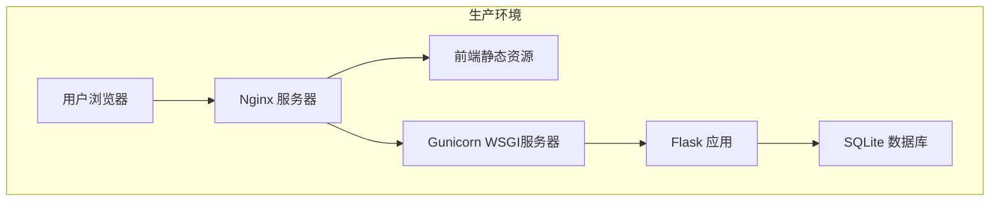

# 智能停车管理系统架构文档

## 1. 项目概述

智能停车管理系统是一个基于Web的应用程序，旨在为用户提供便捷的停车场查询、车位预订、停车记录查询和违规记录管理等功能。系统采用前后端分离的架构设计，前端使用Vue 3 + Element Plus构建，后端使用Flask + SQLite开发，实现了用户管理、停车场管理、车辆管理、停车记录管理和违规记录管理等核心功能。

## 2. 技术栈

### 2.1 前端技术栈

| 技术 | 版本 | 用途 |
| --- | --- | --- |
| Vue | 3.2.13 | 前端框架 |
| Vue Router | 4.5.1 | 路由管理 |
| Element Plus | 2.11.4 | UI组件库 |
| Element Plus Icons | 2.3.2 | 图标库 |
| TSParticles | 3.9.1 | 粒子效果 |

### 2.2 后端技术栈

| 技术 | 版本 | 用途 |
| --- | --- | --- |
| Flask | 2.0.1 | Web框架 |
| Flask-CORS | 3.0.10 | 跨域资源共享 |
| SQLite | 3.36.0 | 数据库 |
| PyJWT | 2.1.0 | 身份验证 |
| Werkzeug | 2.0.1 | WSGI工具库 |
| hashlib | 内置 | 密码加密 |

## 3. 系统架构设计

### 3.1 架构概述

系统采用前后端分离的架构设计，前端和后端通过RESTful API进行通信。前端负责用户界面的展示和用户交互，后端负责业务逻辑处理和数据存储。

### 3.2 架构分层

#### 3.2.1 前端架构分层

| 层次 | 职责 | 技术实现 |
| --- | --- | --- |
| 视图层 | 用户界面展示 | Vue 3 + Element Plus |
| 路由层 | 页面导航管理 | Vue Router |
| 组件层 | 可复用UI组件 | Vue 3 组件 |
| 服务层 | API请求封装 | Fetch API |
| 状态管理 | 全局状态管理 | Vue 3 Composition API |

#### 3.2.2 后端架构分层

| 层次 | 职责 | 技术实现 |
| --- | --- | --- |
| 路由层 | API路由定义 | Flask 路由装饰器 |
| 控制器层 | 请求处理逻辑 | Flask 视图函数 |
| 业务逻辑层 | 核心业务处理 | Python 函数 |
| 数据访问层 | 数据库操作 | SQLite 3 |
| 工具层 | 辅助功能 | 自定义工具函数 |

### 3.3 系统架构图



## 4. 模块划分

### 4.1 前端模块

| 模块 | 职责 | 页面/组件 |
| --- | --- | --- |
| 登录注册模块 | 用户身份验证 | Login.vue, Register.vue |
| 停车场模块 | 停车场查询与管理 | ParkingLots.vue |
| 车辆管理模块 | 用户车辆管理 | MyVehicles.vue |
| 车位预订模块 | 车位预订功能 | MakeReservation.vue |
| 停车记录模块 | 停车记录查询 | ParkingRecords.vue |
| 违规记录模块 | 违规记录管理 | Violations.vue |
| 个人中心模块 | 用户信息管理 | Profile.vue |
| 管理员模块 | 后台管理功能 | Admin/ParkingLotManagement.vue, Admin/DataAnalysis.vue, Admin/ViolationManagement.vue |
| 布局组件 | 页面布局 | Layout.vue |

### 4.2 后端模块

| 模块 | 职责 | API路径 |
| --- | --- | --- |
| 用户管理模块 | 用户注册、登录、信息管理 | /api/user/* |
| 车辆管理模块 | 车辆信息管理 | /api/user/vehicles/* |
| 停车场管理模块 | 停车场和车位信息管理 | /api/parking/* |
| 停车记录模块 | 停车记录查询与管理 | /api/user/records, /api/parking/records |
| 违规记录模块 | 违规记录查询与管理 | /api/user/violations, /api/violations/* |
| 预订管理模块 | 车位预订管理 | /api/reservation |
| 管理员模块 | 后台管理功能 | /api/admin/* |

## 5. 数据库设计

### 5.1 数据库概述

系统使用SQLite数据库，包含7个主要表，分别是users、parking_lots、parking_spaces、vehicles、parking_records、reservations和violations。

### 5.2 数据表结构

#### 5.2.1 users表

| 字段名 | 数据类型 | 约束 | 描述 |
| --- | --- | --- | --- |
| id | INTEGER | PRIMARY KEY AUTOINCREMENT | 用户ID |
| username | TEXT | UNIQUE NOT NULL | 用户名 |
| password | TEXT | NOT NULL | 密码（SHA256/MD5加密） |
| role | TEXT | NOT NULL DEFAULT 'user' | 用户角色（admin/user） |

#### 5.2.2 parking_lots表

| 字段名 | 数据类型 | 约束 | 描述 |
| --- | --- | --- | --- |
| id | INTEGER | PRIMARY KEY AUTOINCREMENT | 停车场ID |
| name | TEXT | NOT NULL | 停车场名称 |
| location | TEXT | NOT NULL | 停车场地址 |
| gps_coordinates | TEXT | NOT NULL | GPS坐标 |
| total_spaces | INTEGER | NOT NULL | 总车位数 |
| available_spaces | INTEGER | NOT NULL | 可用车位数 |
| hourly_rate | REAL | NOT NULL | 小时费率 |

#### 5.2.3 parking_spaces表

| 字段名 | 数据类型 | 约束 | 描述 |
| --- | --- | --- | --- |
| id | INTEGER | PRIMARY KEY AUTOINCREMENT | 车位ID |
| parking_lot_id | INTEGER | NOT NULL | 所属停车场ID |
| space_number | TEXT | NOT NULL | 车位编号 |
| status | TEXT | NOT NULL DEFAULT 'free' | 车位状态（free/reserved/occupied） |

#### 5.2.4 vehicles表

| 字段名 | 数据类型 | 约束 | 描述 |
| --- | --- | --- | --- |
| id | INTEGER | PRIMARY KEY AUTOINCREMENT | 车辆ID |
| user_id | INTEGER | NOT NULL | 所属用户ID |
| license_plate | TEXT | NOT NULL | 车牌号 |
| brand | TEXT | NOT NULL | 车辆品牌 |
| color | TEXT | NOT NULL | 车辆颜色 |

#### 5.2.5 parking_records表

| 字段名 | 数据类型 | 约束 | 描述 |
| --- | --- | --- | --- |
| id | INTEGER | PRIMARY KEY AUTOINCREMENT | 记录ID |
| user_id | INTEGER | NOT NULL | 用户ID |
| vehicle_id | INTEGER | NOT NULL | 车辆ID |
| parking_lot_id | INTEGER | NOT NULL | 停车场ID |
| entry_time | TEXT | NOT NULL | 入场时间 |
| exit_time | TEXT | NULL | 出场时间 |
| cost | REAL | NULL | 停车费用 |

#### 5.2.6 reservations表

| 字段名 | 数据类型 | 约束 | 描述 |
| --- | --- | --- | --- |
| id | INTEGER | PRIMARY KEY AUTOINCREMENT | 预订ID |
| user_id | INTEGER | NOT NULL | 用户ID |
| parking_lot_id | INTEGER | NOT NULL | 停车场ID |
| parking_space_id | INTEGER | NOT NULL | 车位ID |
| vehicle_id | INTEGER | NOT NULL | 车辆ID |
| start_time | TEXT | NOT NULL | 开始时间 |
| end_time | TEXT | NOT NULL | 结束时间 |
| status | TEXT | NOT NULL DEFAULT 'booked' | 预订状态 |
| total_cost | REAL | NULL | 总费用 |

#### 5.2.7 violations表

| 字段名 | 数据类型 | 约束 | 描述 |
| --- | --- | --- | --- |
| id | INTEGER | PRIMARY KEY AUTOINCREMENT | 违规ID |
| user_id | INTEGER | NOT NULL | 用户ID |
| vehicle_id | INTEGER | NOT NULL | 车辆ID |
| parking_lot_id | INTEGER | NOT NULL | 停车场ID |
| violation_type | TEXT | NOT NULL | 违规类型 |
| violation_time | TEXT | NOT NULL | 违规时间 |
| status | TEXT | NOT NULL DEFAULT 'unpaid' | 处理状态 |
| fine_amount | REAL | NULL | 罚款金额 |

### 5.3 数据库实体-关系图



## 6. API设计

### 6.1 API概述

系统后端提供RESTful API，所有API都需要身份验证，使用JWT令牌进行身份验证。API响应格式统一，包含code、message和data字段。

### 6.2 API响应格式

```json
{
  "code": 200,
  "message": "成功",
  "data": {
    // 响应数据
  }
}
```

### 6.3 核心API列表

#### 6.3.1 用户管理API

| API路径 | 请求方法 | 功能描述 |
| --- | --- | --- |
| /api/user/register | POST | 用户注册 |
| /api/user/login | POST | 用户登录 |
| /api/user/profile | GET | 获取用户信息 |
| /api/user/profile | PUT | 更新用户信息 |

#### 6.3.2 车辆管理API

| API路径 | 请求方法 | 功能描述 |
| --- | --- | --- |
| /api/user/vehicles | GET | 获取用户车辆列表 |
| /api/user/vehicles | POST | 添加车辆 |
| /api/user/vehicles/{id} | DELETE | 删除车辆 |

#### 6.3.3 停车场管理API

| API路径 | 请求方法 | 功能描述 |
| --- | --- | --- |
| /api/parking/lots | GET | 获取停车场列表 |
| /api/parking/spaces | GET | 获取车位列表 |

#### 6.3.4 停车记录API

| API路径 | 请求方法 | 功能描述 |
| --- | --- | --- |
| /api/user/records | GET | 获取用户停车记录 |
| /api/parking/records | GET | 获取分页停车记录 |

#### 6.3.5 违规记录API

| API路径 | 请求方法 | 功能描述 |
| --- | --- | --- |
| /api/user/violations | GET | 获取用户违规记录 |
| /api/violations | GET | 获取分页违规记录 |
| /api/violations/{id}/pay | POST | 支付违规罚款 |

#### 6.3.6 预订管理API

| API路径 | 请求方法 | 功能描述 |
| --- | --- | --- |
| /api/reservation | POST | 创建预订 |

## 7. 部署架构

### 7.1 开发环境部署

| 环境 | 配置 |
| --- | --- |
| 前端 | npm run serve |
| 后端 | python app.py |
| 数据库 | SQLite 3 |

### 7.2 生产环境部署

| 组件 | 技术选型 | 配置 |
| --- | --- | --- |
| 前端 | Nginx | 静态资源服务器 |
| 后端 | Gunicorn + Flask | WSGI服务器 |
| 数据库 | SQLite 3 | 数据存储 |
| 服务器 | Linux | 操作系统 |

### 7.3 部署架构图



## 8. 开发流程

### 8.1 代码管理

| 分支 | 用途 |
| --- | --- |
| master | 主分支，用于生产环境 |
| develop | 开发分支，用于集成测试 |
| feature/* | 功能分支，用于开发新功能 |
| bugfix/* | 修复分支，用于修复bug |

### 8.2 开发工具

| 工具 | 用途 |
| --- | --- |
| VS Code | 代码编辑器 |
| Git | 版本控制 |
| Postman | API测试 |
| SQLite Studio | 数据库管理 |

### 8.3 CI/CD流程

1. 开发人员提交代码到feature分支
2. 合并到develop分支进行集成测试
3. 测试通过后合并到master分支
4. 自动部署到生产环境

## 9. 监控与维护

### 9.1 日志管理

| 日志类型 | 配置 |
| --- | --- |
| 前端日志 | 浏览器控制台 |
| 后端日志 | Flask 日志配置 |
| 错误日志 | 单独的错误日志文件 |

### 9.2 性能监控

| 监控项 | 工具 |
| --- | --- |
| 前端性能 | Chrome DevTools |
| 后端性能 | Flask-Profiler |
| 数据库性能 | SQLite 性能分析 |

### 9.3 安全管理

| 安全措施 | 实现方式 |
| --- | --- |
| 密码加密 | SHA256/MD5 |
| 身份验证 | JWT |
| 跨域保护 | CORS |
| 输入验证 | 前端+后端双重验证 |
| SQL注入防护 | 参数化查询 |

## 10. 未来规划

### 10.1 功能扩展

1. **地图集成**：集成地图API，显示停车场的具体位置和周边环境
2. **实时车位监控**：实现车位状态的实时更新和监控
3. **支付功能**：集成支付API，支持在线支付停车费用和违规罚款
4. **消息通知**：添加消息通知功能，提醒用户预订到期、违规记录等
5. **数据分析**：增强数据分析功能，提供更丰富的数据统计和可视化

### 10.2 技术升级

1. **数据库升级**：考虑升级到MySQL或PostgreSQL，支持更大规模的数据存储
2. **后端框架升级**：考虑使用FastAPI或Django，提高后端性能和开发效率
3. **前端框架升级**：跟进Vue 3的最新特性，优化前端性能
4. **微服务架构**：考虑将系统拆分为微服务，提高系统的可扩展性和可维护性
5. **容器化部署**：使用Docker和Kubernetes，简化部署和管理

## 11. 总结

智能停车管理系统采用前后端分离的架构设计，具有良好的可维护性和扩展性。系统实现了用户管理、停车场管理、车辆管理、停车记录管理和违规记录管理等核心功能，能够满足用户的基本需求。未来，系统可以通过功能扩展和技术升级，进一步提高系统的性能和用户体验，为用户提供更加便捷、高效的停车管理服务。
