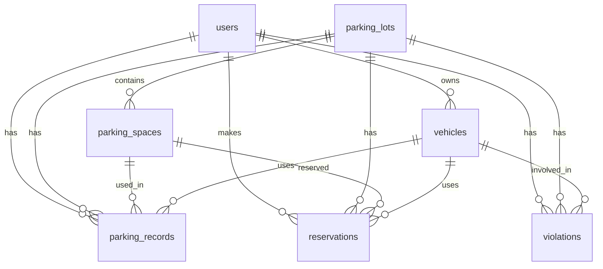
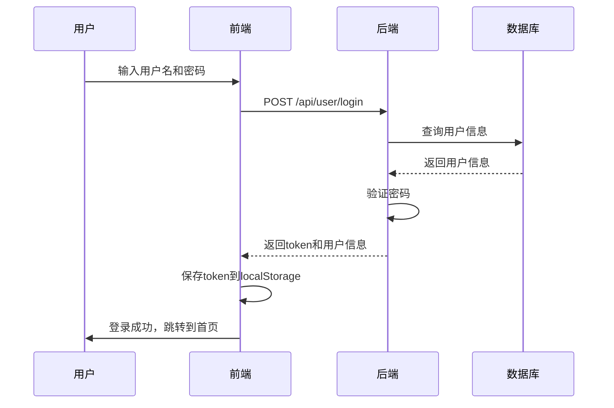
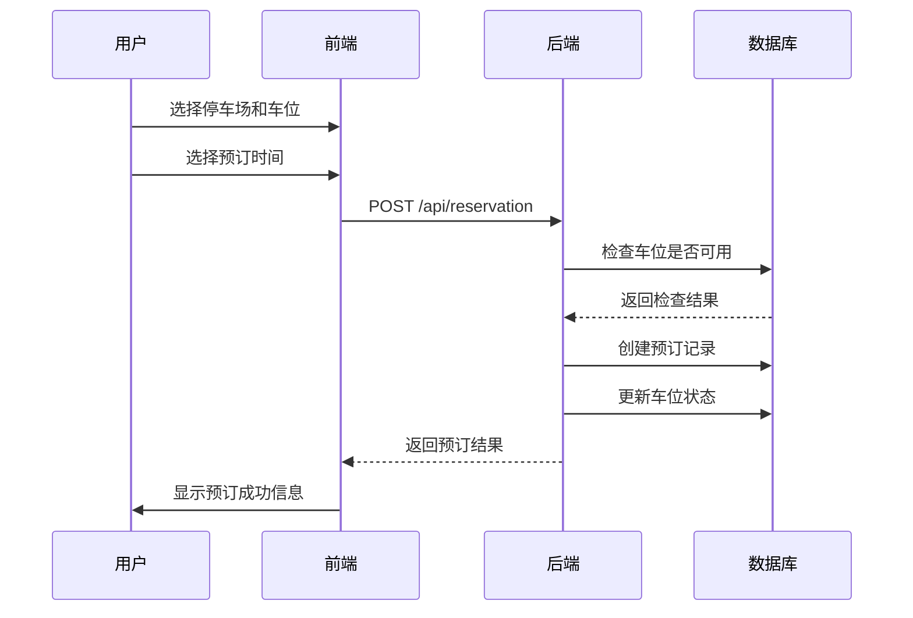

# 智能停车管理系统技术报告

## 1. 项目概述

智能停车管理系统是一个基于Web的应用程序，旨在为用户提供便捷的停车场查询、车位预订、停车记录查询和违规记录管理等功能。系统采用前后端分离的架构设计，前端使用Vue 3 + Element Plus构建，后端使用Flask + SQLite开发，实现了用户管理、停车场管理、车辆管理、停车记录管理和违规记录管理等核心功能。

## 2. 技术栈

### 2.1 前端技术栈

| 技术 | 版本 | 用途 |
| --- | --- | --- |
| Vue | 3.2.13 | 前端框架 |
| Vue Router | 4.5.1 | 路由管理 |
| Element Plus | 2.11.4 | UI组件库 |
| Element Plus Icons | 2.3.2 | 图标库 |
| TSParticles | 3.9.1 | 粒子效果 |

### 2.2 后端技术栈

| 技术 | 版本 | 用途 |
| --- | --- | --- |
| Flask | 2.0.1 | Web框架 |
| Flask-CORS | 3.0.10 | 跨域资源共享 |
| SQLite | 3.36.0 | 数据库 |
| PyJWT | 2.1.0 | 身份验证 |
| Werkzeug | 2.0.1 | WSGI工具库 |

## 3. 数据库设计

### 3.1 数据库结构

智能停车管理系统的数据库包含以下主要表：

1. **users** - 用户表
2. **parking_lots** - 停车场表
3. **parking_spaces** - 车位表
4. **vehicles** - 车辆表
5. **parking_records** - 停车记录表
6. **reservations** - 预订表
7. **violations** - 违规记录表

### 3.2 表结构详情

#### 3.2.1 users表

| 字段名 | 数据类型 | 约束 | 描述 |
| --- | --- | --- | --- |
| id | INTEGER | PRIMARY KEY AUTOINCREMENT | 用户ID |
| username | TEXT | UNIQUE NOT NULL | 用户名 |
| password | TEXT | NOT NULL | 密码（SHA256加密） |
| role | TEXT | NOT NULL DEFAULT 'user' | 用户角色（admin/user） |

#### 3.2.2 parking_lots表

| 字段名 | 数据类型 | 约束 | 描述 |
| --- | --- | --- | --- |
| id | INTEGER | PRIMARY KEY AUTOINCREMENT | 停车场ID |
| name | TEXT | NOT NULL | 停车场名称 |
| location | TEXT | NOT NULL | 停车场地址 |
| gps_coordinates | TEXT | NOT NULL | GPS坐标 |
| total_spaces | INTEGER | NOT NULL | 总车位数 |
| available_spaces | INTEGER | NOT NULL | 可用车位数 |
| hourly_rate | REAL | NOT NULL | 小时费率 |

#### 3.2.3 parking_spaces表

| 字段名 | 数据类型 | 约束 | 描述 |
| --- | --- | --- | --- |
| id | INTEGER | PRIMARY KEY AUTOINCREMENT | 车位ID |
| parking_lot_id | INTEGER | NOT NULL | 所属停车场ID |
| space_number | TEXT | NOT NULL | 车位编号 |
| status | TEXT | NOT NULL DEFAULT 'free' | 车位状态（free/reserved/occupied） |

#### 3.2.4 vehicles表

| 字段名 | 数据类型 | 约束 | 描述 |
| --- | --- | --- | --- |
| id | INTEGER | PRIMARY KEY AUTOINCREMENT | 车辆ID |
| user_id | INTEGER | NOT NULL | 所属用户ID |
| license_plate | TEXT | NOT NULL | 车牌号 |
| brand | TEXT | NOT NULL | 车辆品牌 |
| color | TEXT | NOT NULL | 车辆颜色 |

#### 3.2.5 parking_records表

| 字段名 | 数据类型 | 约束 | 描述 |
| --- | --- | --- | --- |
| id | INTEGER | PRIMARY KEY AUTOINCREMENT | 记录ID |
| user_id | INTEGER | NOT NULL | 用户ID |
| vehicle_id | INTEGER | NOT NULL | 车辆ID |
| parking_lot_id | INTEGER | NOT NULL | 停车场ID |
| entry_time | TEXT | NOT NULL | 入场时间 |
| exit_time | TEXT | NULL | 出场时间 |
| cost | REAL | NULL | 停车费用 |

#### 3.2.6 reservations表

| 字段名 | 数据类型 | 约束 | 描述 |
| --- | --- | --- | --- |
| id | INTEGER | PRIMARY KEY AUTOINCREMENT | 预订ID |
| user_id | INTEGER | NOT NULL | 用户ID |
| parking_lot_id | INTEGER | NOT NULL | 停车场ID |
| parking_space_id | INTEGER | NOT NULL | 车位ID |
| vehicle_id | INTEGER | NOT NULL | 车辆ID |
| start_time | TEXT | NOT NULL | 开始时间 |
| end_time | TEXT | NOT NULL | 结束时间 |
| status | TEXT | NOT NULL DEFAULT 'booked' | 预订状态 |
| total_cost | REAL | NULL | 总费用 |

#### 3.2.7 violations表

| 字段名 | 数据类型 | 约束 | 描述 |
| --- | --- | --- | --- |
| id | INTEGER | PRIMARY KEY AUTOINCREMENT | 违规ID |
| user_id | INTEGER | NOT NULL | 用户ID |
| vehicle_id | INTEGER | NOT NULL | 车辆ID |
| parking_lot_id | INTEGER | NOT NULL | 停车场ID |
| violation_type | TEXT | NOT NULL | 违规类型 |
| violation_time | TEXT | NOT NULL | 违规时间 |
| status | TEXT | NOT NULL DEFAULT 'unpaid' | 处理状态 |
| fine_amount | REAL | NULL | 罚款金额 |

### 3.3 数据库关系图



## 4. 前端功能实现

### 4.1 页面结构

系统前端包含以下主要页面：

1. **登录页** - 用户登录功能
2. **注册页** - 用户注册功能
3. **停车场列表页** - 显示所有停车场信息
4. **我的车辆页** - 管理用户车辆信息
5. **车位预订页** - 预订停车位
6. **停车记录页** - 查看停车记录
7. **违规记录页** - 查看和处理违规记录
8. **个人中心页** - 管理个人信息
9. **管理员页面**
   - 停车场管理
   - 数据分析
   - 违规记录管理

### 4.2 核心组件

#### 4.2.1 Layout组件

Layout组件是系统的布局组件，包含顶部导航栏和侧边栏，实现了页面的统一布局和导航功能。

```vue
<template>
  <div class="layout-container">
    <!-- 顶部导航栏 -->
    <header class="header">
      <div class="logo">智慧停车管理系统</div>
      <div class="user-info">
        <span>欢迎，{{ username }}</span>
        <el-button type="text" @click="logout">退出登录</el-button>
      </div>
    </header>
    
    <!-- 主体内容 -->
    <div class="main-content">
      <!-- 侧边栏 -->
      <aside class="sidebar">
        <el-menu :default-active="activeMenu" class="sidebar-menu" router>
          <!-- 用户菜单 -->
          <el-menu-item index="/parking-lots">
            <el-icon><MapLocation /></el-icon>
            <span>停车场列表</span>
          </el-menu-item>
          <el-menu-item index="/my-vehicles">
            <el-icon><Van /></el-icon>
            <span>我的车辆</span>
          </el-menu-item>
          <!-- 其他菜单项 -->
        </el-menu>
      </aside>
      
      <!-- 内容区域 -->
      <main class="content">
        <router-view></router-view>
      </main>
    </div>
  </div>
</template>
```

#### 4.2.2 ParkingLots组件

ParkingLots组件用于显示所有停车场信息，并支持查看停车场的详细信息和车位情况。

#### 4.2.3 ParkingRecords组件

ParkingRecords组件用于显示用户的停车记录，支持搜索、分页和查看详情等功能。

## 5. 后端API设计

### 5.1 API结构

系统后端提供以下主要API：

1. **用户管理API**
   - POST /api/user/register - 用户注册
   - POST /api/user/login - 用户登录
   - GET /api/user/profile - 获取用户信息
   - PUT /api/user/profile - 更新用户信息

2. **车辆管理API**
   - GET /api/user/vehicles - 获取用户车辆列表
   - POST /api/user/vehicles - 添加车辆
   - DELETE /api/user/vehicles/{id} - 删除车辆

3. **停车场管理API**
   - GET /api/parking/lots - 获取停车场列表
   - GET /api/parking/spaces - 获取车位列表

4. **停车记录API**
   - GET /api/user/records - 获取用户停车记录
   - GET /api/parking/records - 获取分页停车记录

5. **违规记录API**
   - GET /api/user/violations - 获取用户违规记录
   - GET /api/violations - 获取分页违规记录
   - POST /api/violations/{id}/pay - 支付违规罚款

6. **预订管理API**
   - POST /api/reservation - 创建预订

### 5.2 API示例

#### 5.2.1 用户登录API

**请求URL**：/api/user/login

**请求方法**：POST

**请求体**：
```json
{
  "username": "user1",
  "password": "password123"
}
```

**响应**：
```json
{
  "code": 200,
  "data": {
    "token": "eyJhbGciOiJIUzI1NiIsInR5cCI6IkpXVCJ9...",
    "user_id": 2,
    "role": "user"
  }
}
```

## 6. 系统流程

### 6.1 用户登录流程



### 6.2 车位预订流程



## 7. 项目亮点

### 7.1 前后端分离架构

系统采用前后端分离的架构设计，前端和后端独立开发、独立部署，提高了系统的可维护性和扩展性。

### 7.2 响应式设计

前端采用响应式设计，适配不同屏幕尺寸，提供良好的移动端体验。

### 7.3 安全机制

- 密码使用SHA256加密存储
- 使用JWT进行身份验证
- 所有API都需要身份验证

### 7.4 良好的用户体验

- 美观的UI设计
- 流畅的动画效果
- 便捷的操作流程

## 8. 总结与展望

### 8.1 总结

智能停车管理系统是一个功能完整、设计合理的Web应用程序，实现了用户管理、停车场管理、车辆管理、停车记录管理和违规记录管理等核心功能。系统采用前后端分离的架构设计，具有良好的可维护性和扩展性。

### 8.2 展望

1. **添加地图功能** - 集成地图API，显示停车场的具体位置和周边环境
2. **实时车位监控** - 实现车位状态的实时更新和监控
3. **支付功能** - 集成支付API，支持在线支付停车费用和违规罚款
4. **消息通知** - 添加消息通知功能，提醒用户预订到期、违规记录等
5. **数据分析** - 增强数据分析功能，提供更丰富的数据统计和可视化

## 9. 参考文献

1. Vue 3官方文档：https://v3.vuejs.org/
2. Element Plus官方文档：https://element-plus.org/
3. Flask官方文档：https://flask.palletsprojects.com/
4. SQLite官方文档：https://www.sqlite.org/docs.html
5. JWT官方文档：https://jwt.io/

## 10. 附录

### 10.1 项目结构

```
parking-frontend/
├── backend/              # 后端代码
│   ├── app.py            # Flask应用入口
│   ├── parking.db        # SQLite数据库
│   └── requirements.txt  # 依赖列表
├── public/               # 静态资源
├── src/                  # 前端代码
│   ├── assets/           # 资源文件
│   ├── components/       # 组件
│   ├── router/           # 路由配置
│   ├── views/            # 页面
│   ├── App.vue           # 根组件
│   └── main.js           # 入口文件
├── .gitignore            # Git忽略文件
├── package.json          # 项目配置
└── README.md             # 项目说明
```

### 10.2 开发环境

| 环境 | 版本 |
| --- | --- |
| Node.js | 14.17.0+ |
| npm | 6.14.13+ |
| Python | 3.8.0+ |
| pip | 21.0.0+ |

### 10.3 部署说明

1. **前端部署**：
   ```bash
   npm run build
   # 将dist目录部署到Web服务器
   ```

2. **后端部署**：
   ```bash
   pip install -r requirements.txt
   python app.py
   ```

### 10.4 测试账号

| 用户名 | 密码 | 角色 |
| --- | --- | --- |
| admin | admin123 | admin |
| user1 | password123 | user |
| user2 | password456 | user |
